# BuddyBud : SKKU International Community Application

## Project Description
BuddyBud is a mobile application Bridging International & Local Campus Friendships.
<br/><br/>

## Project Duration
2023.09 ~ 2023.12
<br/><br/>

## Role & Responsibility

<br/><br/>

## UI & Features
### Login/Register
Users can enter their school to access the school community. It's a semi-anonymous community where nicknames and profile pictures are public.

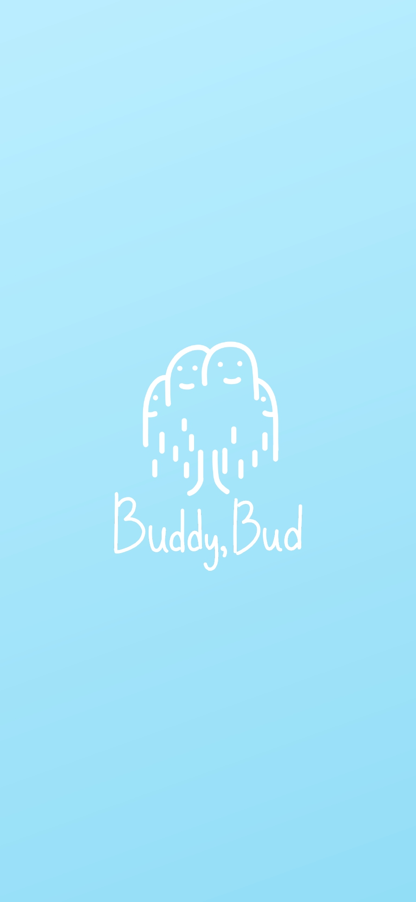 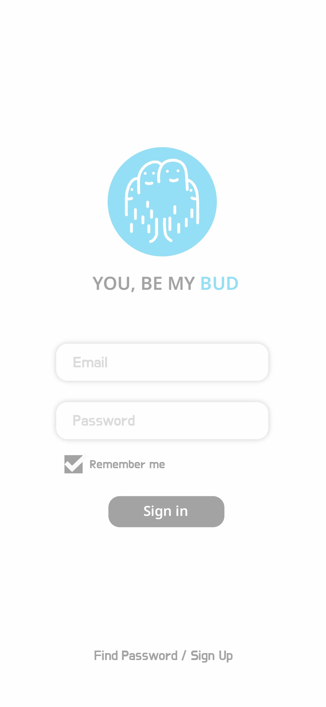 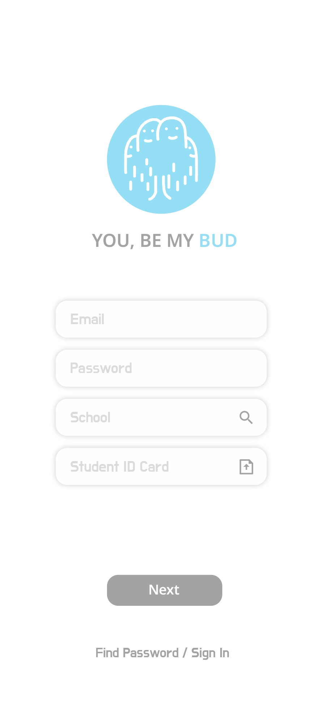


### Feed
In the feed, users can freely post their daily life updates or questions, and with the ability to translate posts and comments, communication is possible without language barriers.

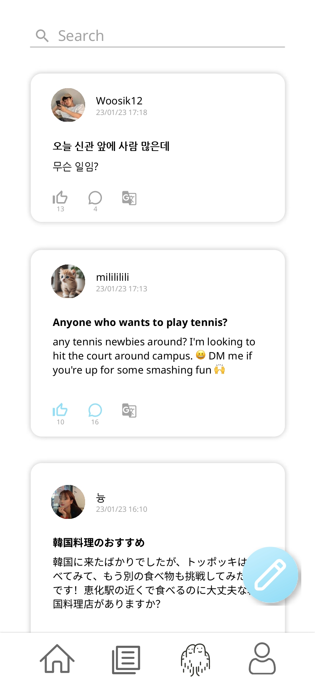  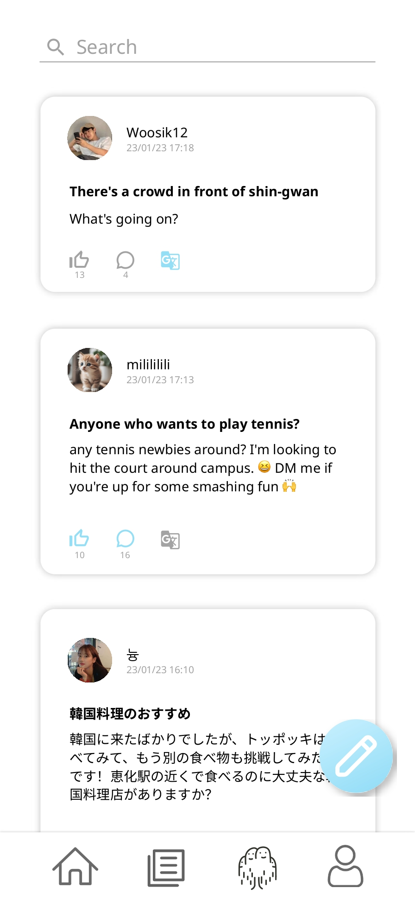  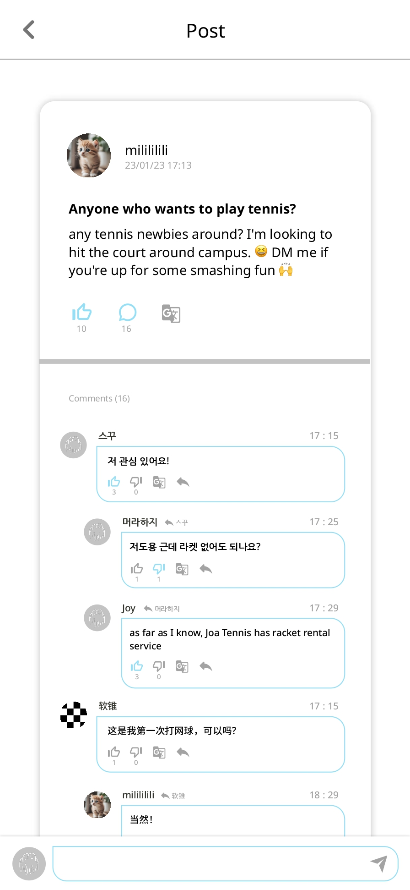  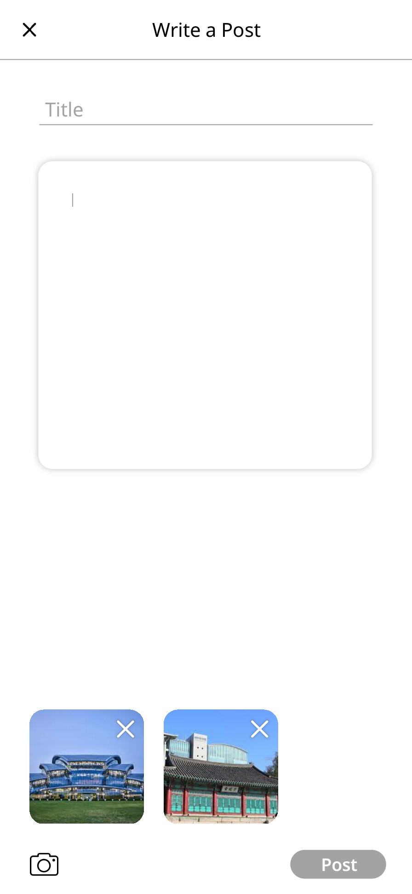

### Board
In the board section, the system automatically crawls and posts various club/event promotional articles from the school's official announcement board and 'Everytime', the largest college student community in Korea. Users can scrap or recommend the posts they find useful.

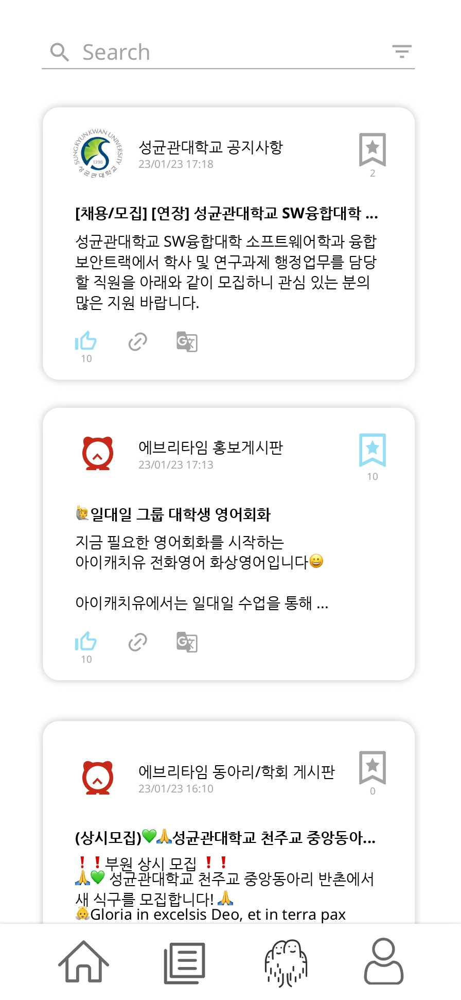 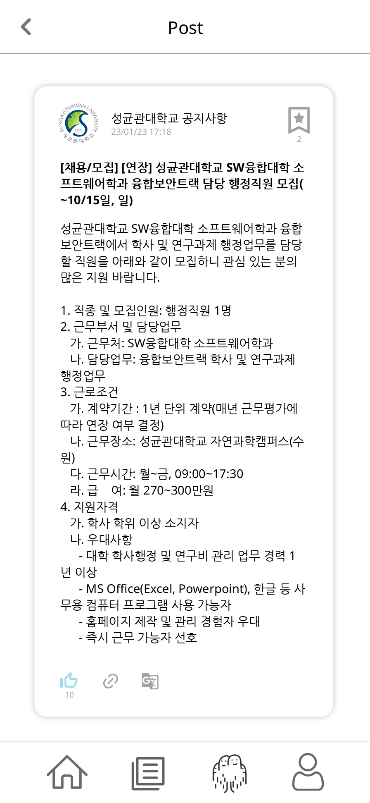

### Willow
Willow is a word created by combining 'willow', the logo of the BuddyBud app, and the concept of 'Follow'. Users can send Willow requests to others they wish to connect with, and upon mutual consent, can become friends and send one-on-one chats.

 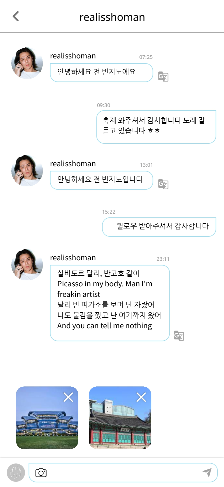 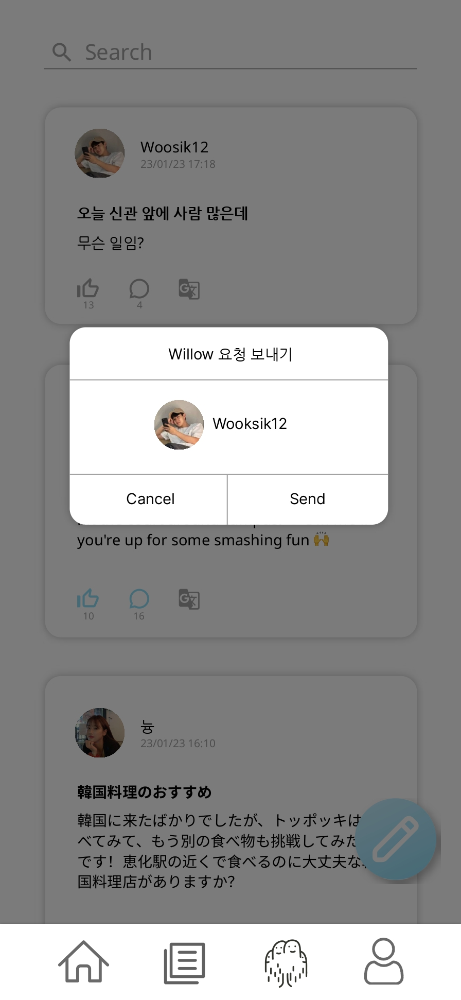 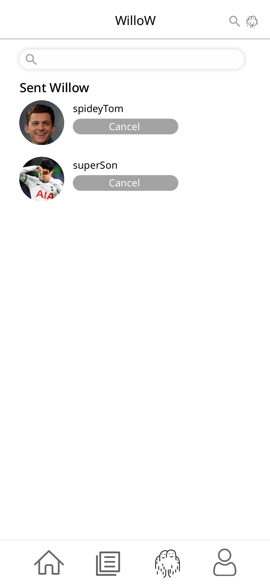

### My Page
In the 'My Page' section, users can view their own posts and the posts they have scrapped, and can also edit their profile as needed.

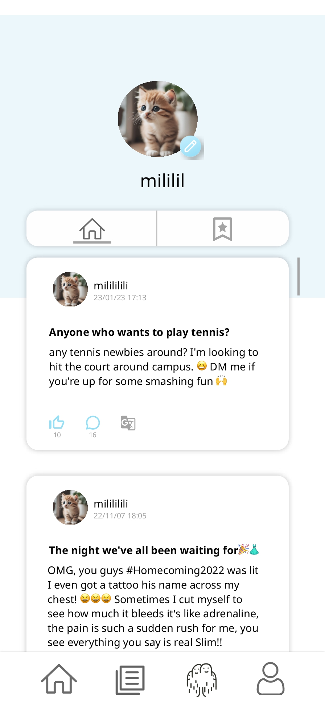 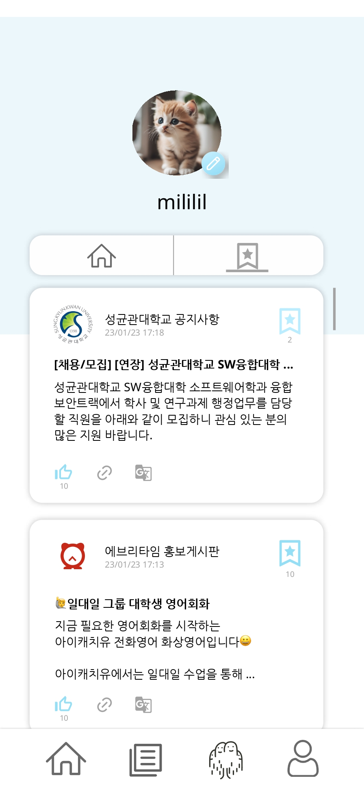 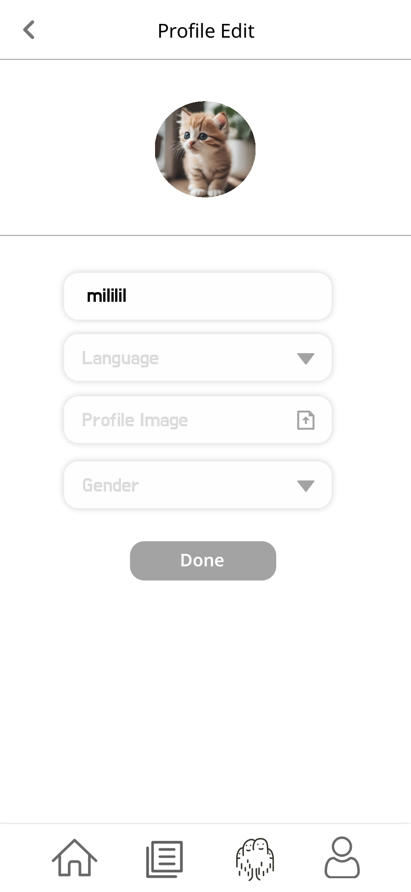 
 
## Requirements
### Environment Settings
- Java Development Kit (JDK) 17
- Android Studio minSDK 28
- Spring Boot 3.1.5
- MySQL 8.0.35
- Frontend : com.swe.buddybud.common.ServerConfig
- Backend : application.properties
- [Database Schema](https://github.com/leedayun/BuddyBud/blob/main/misc/buddybud_231130042918.sql)

### Installation
```
$ git clone https://github.com/leedayun/BuddyBud.git
$ cd BuddyBud
```

### Backend
```
$ cd BE
$ ./gradlew bootJar
$ ./gradlew bootRun
```
You can use .jar file to run server either in the foreground
```
$ java -jar JARFILE.jar
```
or in Daemon
```
$ nohup java -jar JARFILE.jar &
```
<br/><br/>

## Tech Stack
### Frontend


### Backend


### Database


### Enviornment


### Configuration Management


### Communication


<br/><br/>

## ERD
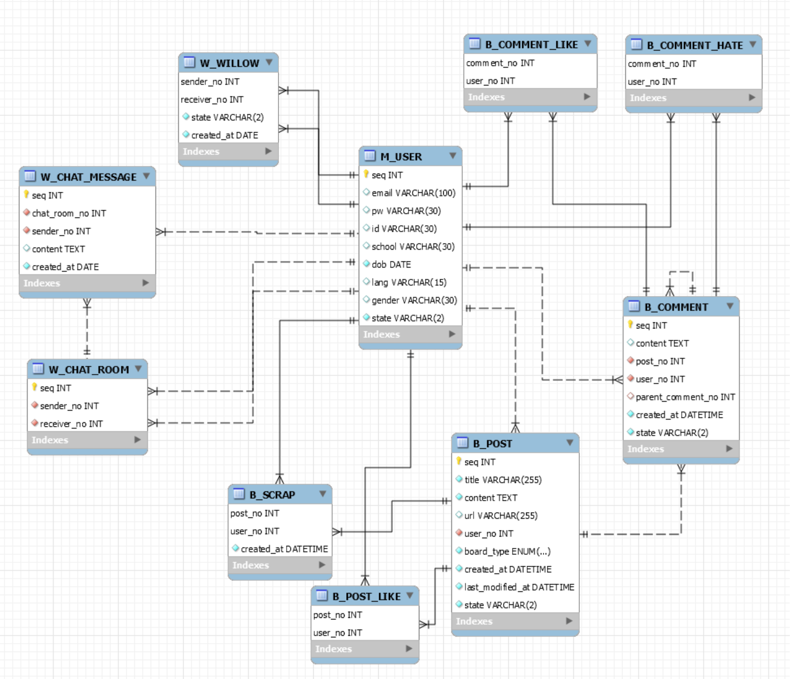
